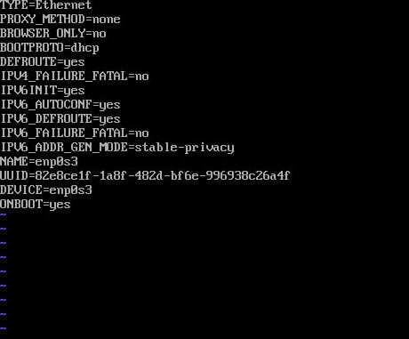

## EPAM University Programs DevOps external course
### Module – Linux Networking
Практична частина модуля Linux Networking передбачає створення засобами
Virtual Box мережі, що показаний на рисунку.

 

### Net1 - 192.168.100.0/24
### Net2 - 10.87.22.0/24
### Net3 - 10.8.87.0/24
### Net4 - 172.16.22.0/24

### Server1 – a virtual machine with Ubunta OS and next network adapters' configuration:
1. Adapter1 - enp0s3 - Bridged Adapter (net1)
2. Adapter2 - enp0s8 - Internal Network (net2)
3. Adapter3 - enp0s9 - Internal Network (net3)

 

### client1 – a virtual machine with Ubunta OS and next network adapters' configuration:
1. Adapter1 - enp0s3 - Internal Network (net2)
2. Adapter2 - enp0s8 - Internal Network (net4)

 

### client2 – a virtual machine with Red Hat (CentOS) OS and next network adapters' configuration:
1. Adapter1 - enp0s3 - Internal Network (net3)
2. Adapter2 - enp0s8 - Internal Network (net4)

**client1 - Ubunta OS - network interface configuration:**

>sudo nano /etc/netplan/00-installer-config.yaml

>sudo netplan apply

**client2 - CentOS - network interface configuration:**

>sudo vi /etc/sysconfig/network-scripts/ifcfg-enp0s3

>sudo vi /etc/sysconfig/network-scripts/ifcfg-enp0s8

>sudo systemctl restart network

1. На Server1 налаштувати статичні адреси на всіх інтерфейсах:

For permanent configuration changed next file on server1:

>sudo nano /etc/netplan/00-installer_config.yaml

2. На Server1 налаштувати DHCP сервіс, який буде конфігурувати адреси Int1
client1 та client2:

Install openssh on server1:

>sudo apt install isc-dhcp-server

Changed next file on server1:

>sudo nano /etc/dhcp/dhcpd.conf

and restarted isc-dhcp-server.service and cheking status service:

>sudo systemctl restart isc-dhcp-server.service

>sudo systemctl status isc-dhcp-server.service

Enabling ip forwarding and make changes in file next command:

>sudo sysctl net.ipv4.ip-forward

>sudo nano /etc/sysctl.conf

#uncomment line  net.ipv4.ip-forward=1

Checking dhcp-lease-list:

3. За допомогою команд ping та traceroute перевірити зв'язок між віртуальними машинами.

3.1. Ping and Traceroute connection from client1 to client2:

**Explanation:** traceroute goes through the default gateway 10.87.22.1 - interface to server1, and then the next one to the destination address 10.8.87.2.

3.2. Ping and Traceroute connection from client1 to client2:

**Explanation:** traceroute goes through the default gateway 10.8.87.1 - interface to server1, and then the next one to the destination address 10.87.22.2.

4. На віртуальному інтерфейсу lo client1 призначити дві ІР адреси за таким
правилом: 172.17.D+10.1/24 (172.17.32.1/24) та 172.17.D+20.1/24 (172.17.42.1/24). Налаштувати маршрутизацію таким чином, щоб трафік з client2 до 172.17.D+10.1 проходив через  server1, а до 172.17.D+20.1 через Net4. Для перевірки використати traceroute.

Add two interfaces on client1 loopback interface and show the resalt:

>sudo ip addr add 172.17.32.1/24 dev lo

>sudo ip addr add 172.17.42.1/24 dev lo

>ip -o addr dev lo

**server1:**

 Add a route on server1 to get traffic from client2 to 172.17.32.1 goes through server1 and check the availability route list:

>sudo ip route add 172.17.32.0/24 via 10.87.22.2

>ip r

Verify that traffic from client2 to 172.17.32.1 goes through server1. Addresses gateway (10.8.87.1) belong server1 interface on.

**client2:**
Add a route on client2 to get traffic from client2 to 172.17.42.1 goes through net4:

>nmcli con mod enp0s3 ipv4.routes "172.17.32.0/24 10.8.87.1"

>nmcli con mod enp0s8 ipv4.routes "172.17.42.0/24 172.16.22.1"

>sudo systemctl restart network

5. Розрахувати спільну адресу та маску (summarizing) адрес 172.17.D+10.1 та
172.17.D+20.1, при чому префікс має бути максимально можливим. Видалити
маршрути, встановлені на попередньому кроці та замінити їх об’єднаним
маршрутом, якій має проходити через server1.

Delete routes set earlier:

**client2**:
>sudo ip route del 172.17.42.0/24 via 172.16.22.2 dev enp0s8

**server1**:
>sudo ip route del 172.17.32.0/24 via 10.87.22.2

Add a new route on server1:

>sudo ip route add 172.17.32.0/19 via 10.87.22.2

Traffic from client2 to 172.17.32.1 and 172.17.42.1 goes through server1. Addresses _gateway (10.8.87.1) - interface on server1.

6. Налаштувати SSH сервіс таким чином, щоб client1 та client2 могли
підключатись до server1 та один до одного.

SSH configuration server1:

>sudo systemctl start ssh

>sudo systemctl start ssh

>sudo ufw allow OpenSSH

>sudo ufw enable

>sudo ufw status

Created the pair of ssh keys, for the virtual machines. The keys may be identical to the name of the virtual machine:

>ssh-keygen -t rsa -f ~/.ssh/client1

>ssh-keygen -t rsa -f ~/.ssh/client1

6.1. **client1**:
Copy the public key and connect from client1 to client2 (10.8.87.2) and server1 (10.87.22.1):

>ssh-copy-id -i ~/.ssh/client1.pub guseva@10.87.22.1

>ssh-copy-id -i ~/.ssh/client1.pub guseva@10.8.87.2

6.12. **client2**:

Copy the public key and connect access from client2 to client1 (10.87.22.1) and server1 (10.87.22.1):

>ssh-copy-id -i ~/.ssh/client2.pub guseva@10.8.87.1

>ssh-copy-id -i ~/.ssh/client2.pub guseva@10.87.22.2

7. Налаштуйте на Server_1 firewall таким чином:

7.1.  Дозволено підключатись через SSH з client1 та заборонено з client2.

**server1**:
> sudo iptables -A INPUT -p tcp -s 10.87.22.2/24 --dport 22 -j ACCEPT

>sudo iptables -A INPUT -p tcp -s 10.8.87.2/24 --dport 22 -j DROP

7.2. З client2 на 172.17.D+10.1 ping проходив, а на 172.17.D+20.1 не проходив.

**server1**:
>sudo iptables -A FORWARD -p ICMP -s 10.8.87.2/24 -d 172.17.32.1/24 -j ACCEPT

>sudo iptables -A FORWARD -p ICMP -s 10.8.87.2/24 -d 172.17.42.1/24 -j DROP

8. Якщо в п.3 була налаштована маршрутизація для доступу client1 та client2 до мережі Інтернет – видалити відповідні записи. На server1 налаштувати NAT
сервіс таким чином, щоб з client1 та client2 проходив ping в мережу Інтернет

NAT service configuration:

>sudo iptables -t nat -A POSTROUTING -s 10.0.0.0/8 -j SNAT --to-source 192.168.100.42

>sudo iptables -t nat -L

Connecting to client1, client2  and try ping to 8.8.8.8. Ping turns successfully.

